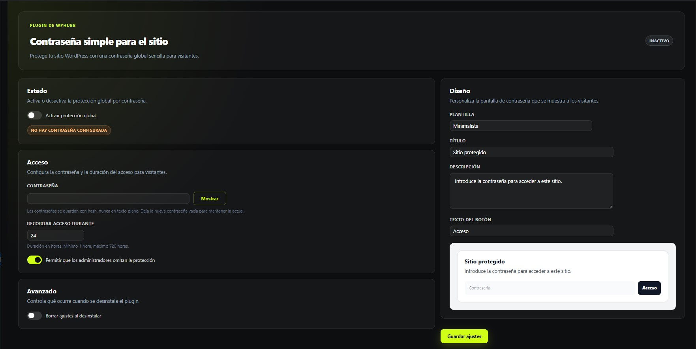
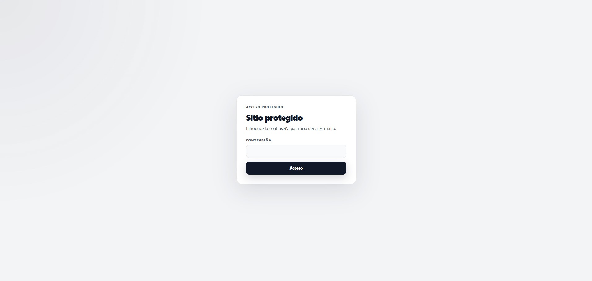
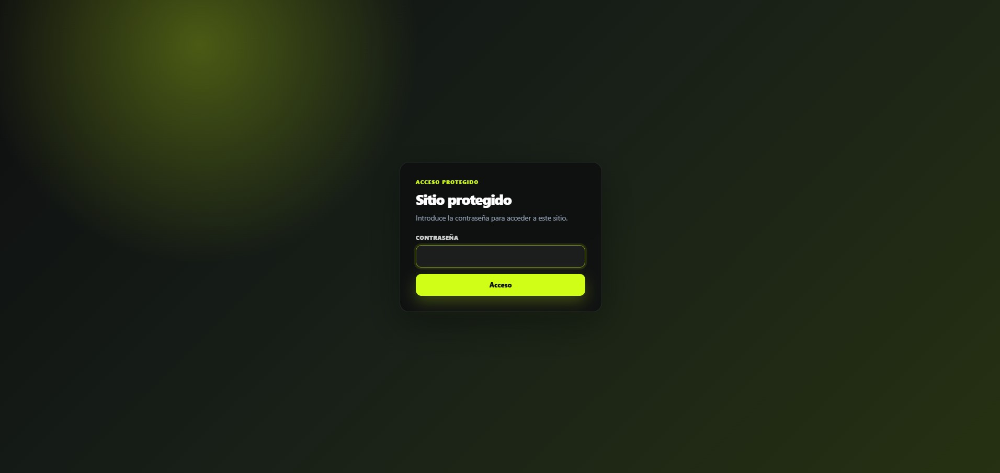
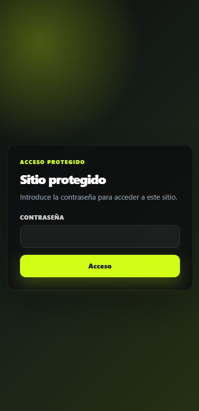

# Simple Site Password

Plugin WordPress para proteger un sitio completo con una contraseña global.

Este plugin forma parte de una serie de proyectos open source orientados a portfolio, donde documento el proceso completo de creación de plugins WordPress: idea, alcance, arquitectura, seguridad, UX, validación y publicación.

## Problema que resuelve

Hay situaciones donde no necesitas un sistema de membresías completo, pero sí quieres ocultar temporalmente una web:

- sitio en desarrollo,
- demo privada para cliente,
- landing antes de lanzamiento,
- catálogo temporalmente privado,
- sitio interno sencillo,
- proyecto que aún no debe ser visible públicamente.

**Simple Site Password** añade una pantalla de contraseña antes de permitir el acceso al sitio público.

## Características

- Protección global por contraseña para visitantes.
- Contraseña guardada como hash, nunca en texto plano.
- Cookie de acceso firmada con duración configurable.
- Bypass opcional para administradores.
- No bloquea rutas críticas de WordPress:
  - `wp-login.php`,
  - `wp-admin`,
  - AJAX,
  - REST API,
  - WP Cron,
  - WP-CLI.
- Tres templates para la pantalla de acceso:
  - Minimal,
  - Dark,
  - Gradient.
- Personalización de título, descripción y texto del botón.
- Preview en tiempo real dentro del panel de ajustes.
- Interfaz traducida a español.
- Limpieza opcional de ajustes al desinstalar.

## Capturas

### Panel de ajustes



### Template Minimal



### Template Dark


### Template Gradient



### Vista móvil



## Qué no es

Este plugin no pretende sustituir:

- sistemas de membresía,
- firewalls,
- control de acceso por roles,
- autenticación empresarial,
- medidas avanzadas para información altamente sensible.

Está pensado para una protección simple por contraseña en escenarios de bajo riesgo o acceso temporal.

## Instalación

1. Copia la carpeta del plugin en:

   ```text
   /wp-content/plugins/
   ```

2. Activa el plugin desde el panel de WordPress.
3. Ve a:

   ```text
   Ajustes → Simple Site Password
   ```

4. Configura una contraseña.
5. Activa la protección global.
6. Guarda los ajustes.

## Decisiones técnicas

### Contraseña hasheada

La contraseña no se guarda en texto plano. Se almacena usando funciones de hashing de WordPress.

Esto significa que la contraseña actual no puede revelarse después de guardarla. Solo puede reemplazarse por una nueva.

### Cookie firmada

Cuando un visitante introduce la contraseña correcta, el acceso se recuerda mediante una cookie firmada.

Si la contraseña cambia, las cookies anteriores quedan invalidadas.

### Rutas críticas excluidas

El plugin evita bloquear rutas necesarias para que WordPress siga funcionando:

- login,
- administración,
- AJAX,
- REST API,
- cron,
- WP-CLI.

### Diseño aislado

La pantalla de contraseña usa clases CSS prefijadas para evitar conflictos con temas o plugins.

## Estructura del plugin

```text
simple-site-password/
├─ assets/
│  ├─ css/
│  └─ js/
├─ includes/
├─ languages/
├─ LICENSE
├─ README.md
├─ readme.txt
├─ simple-site-password.php
└─ uninstall.php
```

## Documentación WordPress.org

El archivo `readme.txt` se mantiene en inglés porque está pensado para compatibilidad con el repositorio oficial de WordPress.org.

Este `README.md` está en español porque el proyecto también sirve como portfolio para LinkedIn y empresas de habla hispana.

## Estado del proyecto

Versión actual:

```text
0.1.4
```

Pendiente antes de una versión 1.0:

- validación final completa,
- capturas,
- posible release/tag,
- post final de LinkedIn.

## Licencia

GPLv2 or later.
